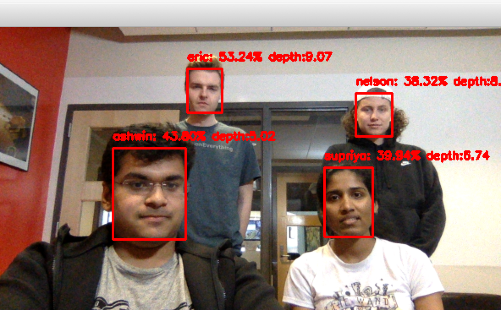
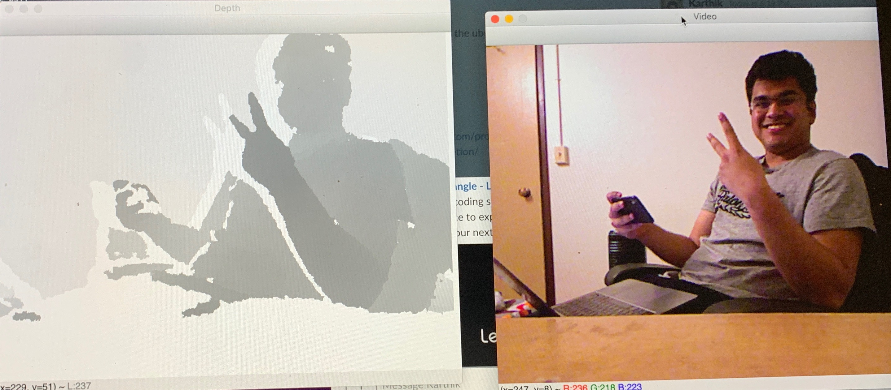

# FinalProject-Marauders_Map

## Team
* Talia Krause:[@takr3985](https://github.com/takr3985)
* Eric Minor:[@em370](https://github.com/em370)
* Nelson Mitchell:[@nelsonnn](https://github.com/nelsonnn)
* Supriya Naidu:[@supriyanaidu](http://github.com/supriyanaidu)
* Ashwin Sankaralingam:[@ashwinroot](https://github.com/ashwinroot)

## Proposal Doc
* https://docs.google.com/document/d/19EeRxV9COkoVDNrlFFKW70RFBYf5CdJIvWsstcOccXc/edit

## Prototype(release v0.0.1):
- Face recognition, face boundary detection and relative depth sensing 
- Face Recognition via WebCam:

- Depth sensor via Kinect:

- Initial animation for webapp:         

- Youtube Demos:
  * [Demo](https://youtu.be/TrNAKGQKF4Q)
  * [How to Run](https://youtu.be/pv_LqElPHjc)

#### TODO:
* Refactor into classes
* Visualize a 2d pygame environment (using relative depth)
* Connect with Kinect
* Play with kinect get-depth
* Create an app that allows to add images directly from phone.
* Experimentation with height and angle

